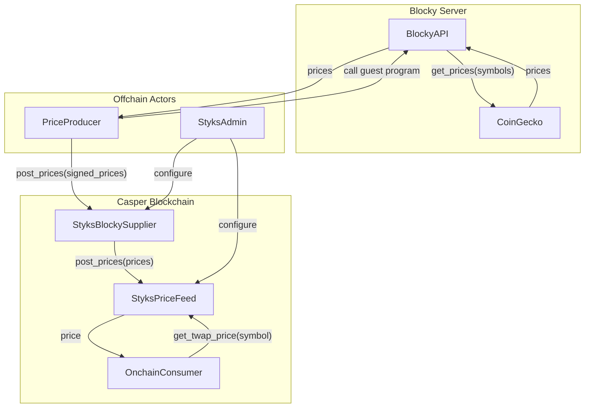
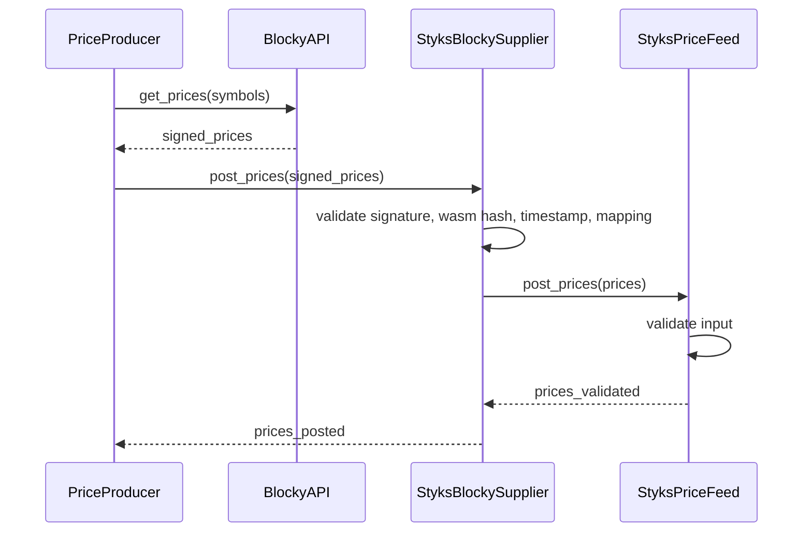

# Styks 

The very first onchain price oracle for Casper.

<!-- WEBSITE: START -->

Styks is deployed on the Casper Testnet.

- Status: <span style="color: #b5e853"><b>Active</b></span>.
- <span style="color: #b5e853"><b>StyksPriceFeed</b></span> contract: [testnet.cspr.live/2879...1acc](https://testnet.cspr.live/contract-package/2879d6e927289197aab0101cc033f532fe22e4ab4686e44b5743cb1333031acc).
- <span style="color: #b5e853"><b>StyksBlockySupplier</b></span> contract: [testnet.cspr.live/fe8b...c5a9](https://testnet.cspr.live/contract-package/fe8b1829844276b21e8d577d525808ed36cc9e12c06b5acfb897204e5b49c5a9).
- Available price feed: <span style="color: #b5e853"><b>CSPRUSD</b></span>.
- Current heartbeat interval: <span style="color: #b5e853"><b>30 minutes</b></span>.


Recent changes:

- 2025/08/18 - Heartbeat interval changed to 30 minutes.
- 2025/08/17 - `StyksBlockySupplier` deployed to the Casper Testnet.
- 2025/08/07 - `StyksPriceFeed` deployed to the Casper Testnet.


---

Below you can find detailed description of the Styks project.

[TOC]

## Why does Casper need a price oracle?

The price oracle is a piece of public infrastructure, that ports a price data
from the outside world to the blockchain in safe manner. Lack of it, prevented
Casper community from developing complex DeFi protocols, such as lending,
borrowing, derivatives, complex liquidity pools, leverage trading, prediction
markets and more.

Styks brings a reliable and secure price feeds to the Casper ecosystem for
others to build on top of it. 

**It is free to use!**

## Onchain integration

Before diving into details of how Styks works, if you just want to use the price
feed in your smart contract, just call `get_twap_price` entry point of the
`StyksPriceFeed` smart contract. It returns the latest price for the requested
price_feed_id, or `None` if the price feed is not available.

Example using `Odra`:

```rust
let styks = StyksPriceFeedContractRef::new(env, styks_price_feed_address);
let price: Option<u64> = styks.get_twap_price(String::from("CSPRUSD"));
```

Example using `casper-contract`:

```rust
let price: Option<u64> = runtime::call_versioned_contract(
    styks_price_feed_address,
    None,
    "get_twap_price",
    runtime_args! {
        "id" => String::from("CSPRUSD")
    }
);
```

## System High Level Architecture

Styks architecture consists of four main components:

- Blocky Server -  for fetching the latest, signed prices from the CoinGecko
  API.
- Onchain smart contracts - `StyksBlockySupplier` and `StyksPriceFeed` for storing
  and operating the prices onchain.
- `PriceProducer` - offchain component, that is responsible for fetching the
  latest prices from the Blocky Server and posting them to the `StyksBlockySupplier`
  contract.
- `StyksAdmin` - admin account, that is responsible for maintaining the correct configuration of smart contracts.



## Blocky

Styks leverages [Blocky](https://blocky-docs.redocly.app/), a trusted execution
service that solves a key challenge in oracle design: how to verify that
external data hasn't been tampered with.

Traditional oracles face a trust issue - how can smart contracts verify that
price data actually came from the claimed source (like CoinGecko) and wasn't
modified by the oracle operator?

The Solution Blocky provides **verifiable computation** through these steps:

1. **Guest Program**: A small WebAssembly (WASM) program that contains the exact
   logic for fetching data.
2. **Secure Execution**: Blocky runs this program in a secure environment. 
3. **Cryptographic Proof**: Blocky signs the results, proving the data came from
   running the specific program.

### How Styks Uses Blocky

`PriceProducer` uploads a simple guest program to Blocky that:

- Fetches the latest cryptocurrency prices from CoinGecko's API.
- Returns all prices as a single data package
- Gets cryptographically signed by Blocky's servers

This signature proves that:

- The data actually came from CoinGecko (not fabricated)
- The specific program was executed (no hidden modifications)
- The results haven't been altered

The `PriceProducer` simply executes this verified program and submits the signed
results to the blockchain.

## Heartbeat

Styks uses the heartbeat mechanism to control the price feed updates. It is a
simple, but effective way of scheduling tasks. It requires `PriceProducer` to
update the price feed once per given time interval, labelled as
`heartbeat_interval`. For example if the interval is 5 minutes, then heartbeats
are at 00:00, 00:05, 00:10, etc. If the `PriceProducer` misses the heartbeat,
then it should try to catch the next one.

It is not possible to send the updates exactly at the heartbeat time, so
`PriceProducer` is allowed to send it within some time around the heartbeat
time, defined as `heartbeat_tolerance`. For example if the tolerance is 
2 minutes, and the next heartbeat is at 11:05, then the `PriceProducer`
can send the update between 11:03 and 11:07 (inclusive).

Actions taken within the tolerance window are treated as they would happen
exactly at the heartbeat time. This decision was made to simplify the system's
design and allow for multiple `PriceProducers` to work in parallel in future.

Data can be sent only once per heartbeat, so if the `PriceProducer` sends
multiple updates within the tolerance window, only the first one is accepted
and the rest are rejected.

## Time Weighted Average Price (TWAP)

Styks uses the Time Weighted Average Price (TWAP) algorithm to calculate the
price. Due to the interval nature of the heartbeat mechanism, which ensures
prices are updated in the constant intervals, the TWAP is calculated as a simple
average of the price records over the last few heartbeats, defined as
`twap_window`. It can be 1 (to use the latest price) or more.

Algorithm should also handle missed heartbeats and allow some amounts of
hertbeats to be missed before the price feed is considered invalid. It is
defined as `twap_tolerance`. If it is set to 0, then no missed heartbeats are
allowed. If 1 or more, then the price feed is still valid if the `PriceProducer`
missed 1 heartbeat. For example if `twap_window` is 3 and `twap_tolerance` is 2,
then the price feed is still valid if the `PriceProducer` missed 2 heartbeats,
within the last 3 heartbeats. Final price is calculated as a simple average of
all available prices in the last `twap_window` heartbeats and in this example it
is based on a single valid price, because 2 heartbeats were missed.

It still has the `TW` in its name, even that it is a simple average, but the
algorithm might be extended in the future to use more complex TWAP version if
heartbeat mechanism is changed.

## Price Feed Id

Each price feed is identified by a unique identifier, called `PriceFeedId`. The
convention in Styks is to use the format `<base_currency><quote_currency>`, for
example `CSPRUSD` for Casper to USD price feed. Each `PriceFeedId` have
associated information about the name of the CoinGecko symbol.

## StyksPriceFeed Smart Contract

The `StyksPriceFeed` smart contract is the main smart contract of the system.
It has multiple security roles. Each role is responsible for different aspects
of the system.

The roles are defined as follows:

- `AdminRole` - manages roles of other accounts,
- `ConfigManagerRole` - manages price feeds and their configurations,
- `PriceSupplierRole` - must supply the price with new data according to the
  heartbeat schedule,

Anyone can read the twap price using the `get_twap_price(price_feed_id)` entry
point. It returns the value or `None` if the price feed is not available, because
of the missed heartbeats or not being configured.

Configuration of the contract:

- `heartbeat_interval`,
- `heartbeat_tolerance`,
- `twap_window`,
- `twap_tolerance`,
- `price_feed_ids` - list of enabled price feeds.

## StyksBlockySupplier Smart Contract

The `StyksBlockySupplier` smart contract is a bridge between the Blocky server and
the `StyksPriceFeed` smart contract. It is responsible for receiving the signed
prices from the `PriceProducer` and posting them to the `StyksPriceFeed` after
verifying authenticity and freshness.

It is configured as follows:

- `wasm_hash` - hash of the Blocky's guest program (a WASM file).
- `public_key` - public key used to verify the signature of the prices.
- `price_feed_address` - address of the `StyksPriceFeed` contract,
  where the prices are posted.
- `coingecko_feed_ids` - list of mappings between Blocky/CoinGecko identifiers and
  on-chain PriceFeedIds. Example: `("Gate_CSPR_USD", "CSPRUSD")`.
- `timestamp_tolerance` - allowed drift (in seconds) between the reported timestamp
  and the current on-chain time.

Security roles:

- `AdminRole` - manages roles of other accounts,
- `ConfigManagerRole` - manages configuration of the contract.

Note:
- Anyone can submit signed data via `report_signed_prices`, but only data that
  is correctly signed with `public_key`, produced by the expected `wasm_hash`,
  and whose timestamp is within `timestamp_tolerance` will be forwarded to the feed.
- The `StyksBlockySupplier` contract must have the `PriceSupplierRole` assigned
  in the `StyksPriceFeed` contract in order to be able to post the prices there.

## Price Update Procedure

Below is the exact sequence of actions that are taken to update the price feed
with the latest prices.



### Step 1: `PriceProducer` offchain sequence

- `PriceProducer` checks in the `StyksPriceFeed` when is the next heartbeat.
- If the time is right, it starts the update procedure.
- `PriceProducer` loads list of active `(CoinGecko identifier -> PriceFeedId)`
  mappings from the `StyksBlockySupplier` contract configuration.
- `PriceProducer` calls the `BlockyAPI` with the list of symbols to
  fetch the latest prices. It uses the guest program that matches the
  `wasm_hash` configured in the `StyksBlockySupplier` contract.
- `BlockyAPI` responds with the signed prices.
- `PriceProducer` posts the signed prices to the `StyksBlockySupplier` contract.

### Step 2: `StyksBlockySupplier` onchain sequence

- `StyksBlockySupplier` verifies input:
  - the signature matches the configured `public_key`,
  - the guest program hash matches `wasm_hash`,
  - the reported timestamp is within `timestamp_tolerance` of current time,
  - the identifier can be mapped to a configured `PriceFeedId`.
- If all checks pass, it posts raw prices in the format of list(`PriceFeedId` ->
  price) to the `StyksPriceFeed` contract.

### Step 3: `StyksPriceFeed` onchain sequence

- `StyksPriceFeed` checks if the caller (the `StyksBlockySupplier` contract) has the `PriceSupplierRole` role.
- `StyksPriceFeed` for each price in the list checks the following:
  - the `PriceFeedId` is enabled,
  - the price is valid,
  - the time is within the heartbeat tolerance,
  - the price was not already posted in the current heartbeat.
- For each valid price, it update the price of the `PriceFeedId` in the
  `StyksPriceFeed` contract.

## Further Work

Above version of the Styks is the first one, that meets the basic requirements
of the price oracle. It is simple, secure and efficient. However, there are some
features that we are considering to implement.

### Multiple Price Producers

In the above model, there is only one `PriceProducer` that is responsible for
fetching the prices from the `BlockyAPI` and posting them to the
`StyksBlockySupplier` contract. To make system more resilient, we must allow
multiple `PriceProducers` to work in parallel.

We would like to introduce a token-based staking mechanism, that would allow
anyone to become a `PriceProducer`.

### Governance

Initially, Odra.dev team will act as the `StyksAdmin`. We will monitor and
maintain the system, but it is natural to us to transfer the ownership to the
community. We think of a token-based voting DAO that would allow the community
to vote on the changes to the system, such as adding new price feeds, changing
the configuration and manage roles.

### Beyond Price Feeds

Styks is a price oracle, but it can be used for porting any data from the
outside world to the blockchain. There are two main use cases we are internally
exploring:

- Porting data from other blockchains to Casper. For example, we can use
  Blocky to fetch the balance of the Bitcoin address and build an escrow
  to practically exchange BTC for CSPR.
- Quering OpenAI API and porting the results to the blockchain. This can be a
  base for decentralized AI agents.

## Join the Community

Join our [Telegram](https://t.me/+nZHCDA9rl6wzZGZl) to leave your feedback and
follow the project. This is a community-driven project, so we are looking for
contributors to help us with the development, testing, documentation and
marketing.

<!-- WEBSITE: END -->

## Ideas
- Emit CEP95 NFTs on interesting price movements.
- When multiple price producers are available, they sync their actions using the
  heartbeat mechanism. If price producers are not in sync
- Config for amount of possible missed heartbeats before the price feed is considered invalid.
