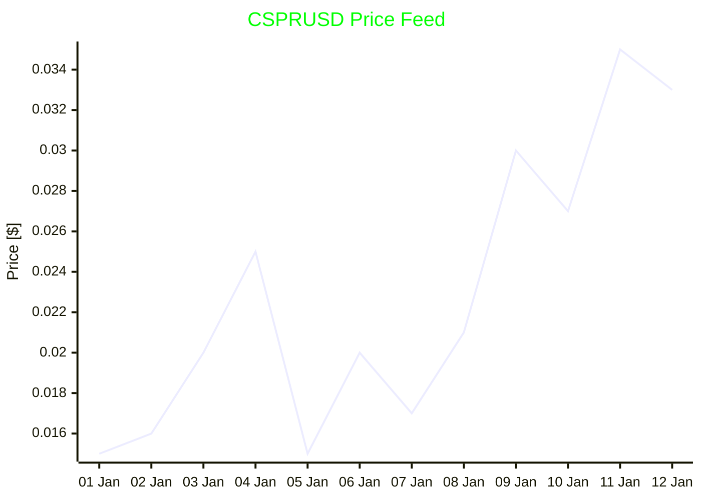
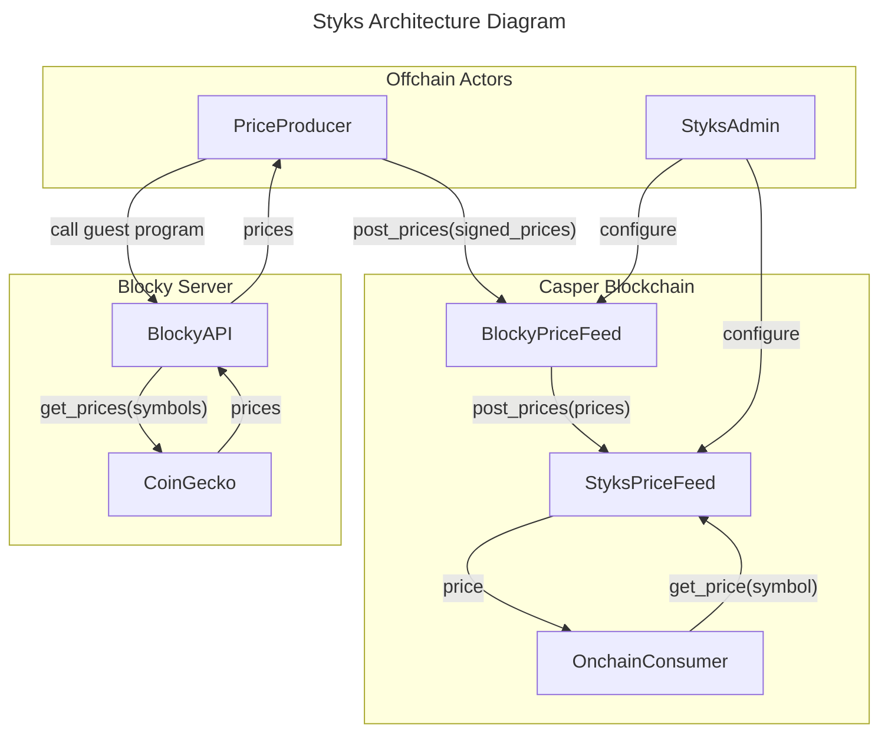

# Styks 

Styks is the very first Casper onchain price oracle.

[ToC](#toc)

## Current Price



## Onchain integration

Before diving into details of how Styks works, if you just want to use the price
feed in your smart contract, just call `get_price` entry point of the
`StyksPriceFeed` smart contract. It returns the latest price for the requested
price_feed_id, or `None` if the price feed is not available.

You can integrate it into your smart contract using the `styks_price_feed` Rust
crate. Example of loading `CSPRUSD` price from the `StyksPriceFeed` smart
contract:
```rust
let price: Option<u128> = styks_price_feed::get_price(
    "hash-123...890", // address of the StyksPriceFeed contract
    "CSPRUSD", // price feed id
)
```

You can also use Odra-based integration to interact with the contract, use it in
tests, or include it in your CLI application.

TODO: Add example of Odra-based integration.

## Why does Casper need a price oracle?

The price oracle is a piece of public infrastructure, that ports a price data
from the outside world to the blockchain in safe manner. Lack of it, prevented
Casper community from developing complex DeFi protocols, such as lending,
borrowing, derivatives, complex liquidity pools, leverage trading, prediction
markets and more.

Styks brings a reliable and secure price feeds to the Casper ecosystem for
others to build on top of it. 

**It is free to use!**

## System High Level Architecture

Styks architecture consists of four main components:
- Blocky Server -  for fetching the latest, signed prices from the CoinGecko
  API.
- Onchain smart contracts - `BlockyPriceFeed` and `StyksPriceFeed` for storing
  and operation the prices onchain.
- `PriceProducer` - offchain component, that is responsible for fetching the
  latest prices from the Blocky Server and posting them to the `BlockyPriceFeed`
  contract.
- `StyksAdmin` - admin account, that is responsible for maintaining the correct configuration of smart contracts.



## Blocky

What makes Styks's architecture simple is using the
[Blocky](https://blocky-docs.redocly.app/) service. It allows anyone to execute
arbitrary WASM file (aka guest program) and receive the result of its execution,
along with the signature of the result, confirming the authenticity of the data.
Guest programs can make HTTP requests which makes it perfect for Styks.

The guest program used in Styks does one thing - it fetches the all the latest
prices from the CoinGecko API and returns them as a single blob of data, signed
by the Blocky server. This allows for trusted architecture with a single
operator, later referred as the `PriceProducer`.

## Heartbeat

Styks uses the heartbeat mechanism to control the price feed updates. It is a
simple, but effective way of scheduling tasks. It requires `PriceProducer` to
update the price feed once per given time interval, labelled as
`heartbeat_interval`. For example if the interval is 5 minutes, then heartbeats
are at 00:00, 00:05, 00:10, etc. If the `PriceProducer` misses the heartbeat,
then it should try to catch the next one.

It is not possible to send the updates exactly at the heartbeat time, so
`PriceProducer` is allowed to send it within some time around the heartbeat
time, defined as `heartbeat_tolerance`. For example if the tolerance is 
2 minutes, and the next heartbeat is at 11:05, then the `PriceProducer`
can send the update between 11:03 and 11:07 (inclusive).

Actions taken within the tolerance window are treated as they would happen
exactly at the heartbeat time. This decision was made to simplify the system's
design and allow for multiple `PriceProducers` to work in parallel in future.

Data can be sent only once per heartbeat, so if the `PriceProducer` sends
multiple updates within the tolerance window, only the first one is accepted
and the rest are rejected.

## Time Weighted Average Price (TWAP)

Styks uses the Time Weighted Average Price (TWAP) algorithm to calculate the
price. Due to the interval nature of the heartbeat mechanism, which ensures
prices are updated in the constant intervals, the TWAP is calculated as a simple
average of the price records over the last few heartbeats, defined as
`twap_window`. It can be 1 (to use the latest price) or more.

Algorithm should also handle missed heartbeats and allow some amounts of
hertbeats to be missed before the price feed is considered invalid. It is
defined as `twap_tolerance`. If it is set to 0, then no missed heartbeats are
allowed. If 1 or more, then the price feed is still valid if the `PriceProducer`
missed 1 heartbeat. For example if `twap_window` is 3 and `twap_tolerance` is 2,
then the price feed is still valid if the `PriceProducer` missed 2 heartbeats,
within the last 3 heartbeats.

It still has the `TW` in its name, even that it is a simple average, but the
algorithm might be extended in the future to use more complex TWAP version if
heartbeat mechanism is changed.

## Price Feed Id

Each price feed is identified by a unique identifier, called `PriceFeedId`. The
convention in Styks is to use the format `<base_currency><quote_currency>`, for
example `CSPRUSD` for Casper to USD price feed. Each `PriceFeedId` have
associated information about the name of the CoinGecko symbol.

## StyksPriceFeed Smart Contract

The `StyksPriceFeed` smart contract is the main smart contract of the system.
It has multiple security roles. Each role is responsible for different aspects
of the system.

The roles are defined as follows:
  - `AdminRole` - manages roles of other accounts,
  - `ConfigManagerRole` - manages price feeds and their configurations,
  - `PriceSupplierRole` - must supply the price with new data according to the
    heartbeat schedule,

Anyone can read the twap price using the `get_twap_price(price_feed_id)` entry
point. It returns the value or `None` if the price feed is not available, because
of the missed heartbeats or not being configured.

Configuration of the contract.
- `heartbeat_interval`,
- `heartbeat_tolerance`,
- `twap_window`,
- `twap_tolerance`,
- `price_feed_ids` - list of enabled price feeds.

## BlockyPriceFeed Smart Contract

The `BlockyPriceFeed` smart contract is a bridge between the Blocky server and
the `StyksPriceFeed` smart contract. It is responsible for receiving the signed
prices from the `PriceProducer` and posting them to the `StyksPriceFeed`.

It is configured as follows:
- `blocky_wasm_hash` - hash of the Blocky server WASM file.
- `blocky_signing_key` - public key of the Blocky server, used to verify the
  signature of the prices.
- `styks_price_feed_address` - address of the `StyksPriceFeed` contract,
  where the prices are posted.
- `price_feed_id_metadata` - key-value map of the price feed ids and their
  associated metadata, such as CoinGecko symbol. Example:
    - (`CSPRUSD`, `CoinGecko`) -> `casper-network`,
    - (`BTCUSD`, `CoinGecko`) -> `bitcoin`.

It is also follows the security roles pattern:
  - `AdminRole` - manages roles of other accounts,
  - `ConfigManagerRole` - manages configuration of the contract,
  - `PriceSupplierRole` - supplies the output of the blocky server to the
    contract.

`PriceProducer` must have the `PriceSupplierRole` role assigned in order to be
able to post the prices.
  
The `BlockyPriceFeed` contract must have the `PriceSupplierRole` role assigned
in the `StyksPriceFeed` contract in order to be able to post the prices. 

## Update Price Feed Procedure

### Step 1: `PriceProducer` offchain sequence:

- `PriceProducer` checks in the `StyksPriceFeed` when is the next heartbeat.
- If the time is right, it starts the update procedure.
- `PriceProducer` load list of active `PriceFeedId`s and their `CoinGecko`
  symbols from the `BlockyPriceFeed` contract.
- `PriceProducer` calls the `BlockyAPI` with the list of symbols to
  fetch the latest prices. It uses the guest program that matches the
  `blocky_wasm_hash` configured in the `BlockyPriceFeed` contract.
- `BlockyAPI` responds with the signed prices.
- `PriceProducer` posts the signed prices to the `BlockyPriceFeed` contract.

### Step 2: `BlockyPriceFeed` onchain sequence:

- `BlockyPriceFeed` checks if the caller has the `PriceSupplierRole` role.
- `BlockyPriceFeed` verifies data:
  - if the signature matches the `blocky_signing_key`,
  - if prices are valid,
  - if `blocky_wasm_hash` matches the one configured in the contract.
- If all checks pass, it posts raw prices in the format of list(`PriceFeedId` ->
  price) to the `StyksPriceFeed` contract.

### Step 3: `StyksPriceFeed` onchain sequence:

- `StyksPriceFeed` checks if the caller has the `PriceSupplierRole` role.
- `StyksPriceFeed` for each price in the list checks the following:
  - the `PriceFeedId` is enabled,
  - the price is valid,
  - the time is within the heartbeat tolerance,
  - the price was not already posted in the current heartbeat.
- For each valid price, it update the price of the `PriceFeedId` in the
  `StyksPriceFeed` contract.


## Ideas
- Emit CEP95 NFTs on interesting price movements.
- When multiple price producers are available, they sync their actions using the
  heartbeat mechanism. If price producers are not in sync
- Config for amount of possible missed heartbeats before the price feed is considered invalid.
